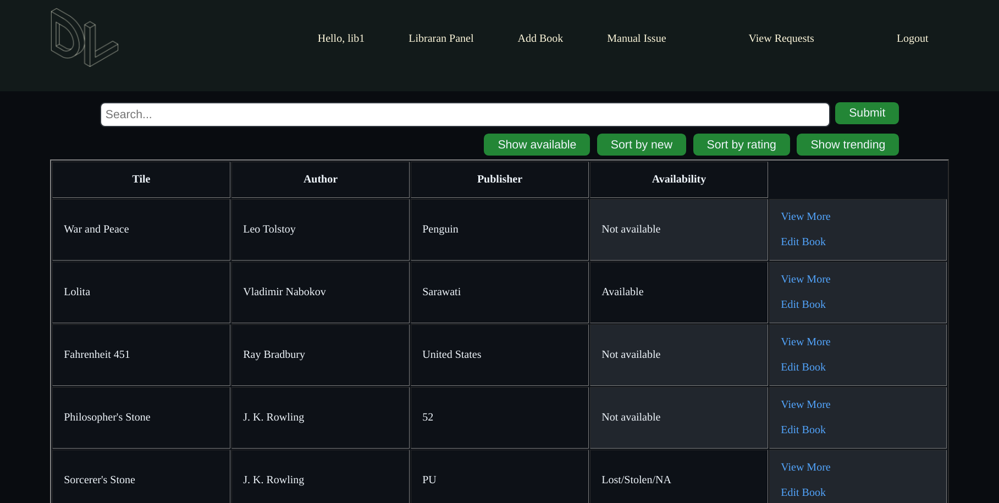

Dev Club assignment for creating a Library Management Webapp.


Open DevLibrary folder to view the django files

# Specification/Requirements covered

1. Register or Login using the portal
2. View the detail of book on a seperate page
3. Search for the book in a search bar with Title
4. Place issue request[If issue request placed, book will become unavailable]
5. Rate the book[Only signed in users can rate once]
6. Users can view the books they have issued/requested/etc.
7. User can be made librarian by admin in the admin panel
8. Librarian can edit books/mark them as unavailable,etc
9. Librarian can issue book[For 7 days]
10. Librarian can also create new book
11. Librarian can also create a manual issue request
12. Users can request for issue period extenion(For upto 7 days more)
13. Librarian can reject or accept the extension
14. If issue overdue, shows the entry in red
15. Nice and appealing dark mode design
16. Checks for username not taken and email not already reistered
17. Button to show top 4 trending books
18. Button to sort by trendng 
19. Button to show only available books
20. Button to sort by new

# Installation

### Install Python
Download and install the latest version of Python from the [Python website](https://www.python.org/downloads/). In the installer, check the box to add Python to your PATH

### Download the Code
Download the source code from github and extract the files

### Open the command prompt/Terminal
Simply open the command prompt (Type cmd in start menu) or Terminal and navigate to the directory where you have saved your files


### Setup a virtual environment
In the command prompt, run the command

```pip install virtualenvwrapper-win```

[If the command does not work try reinstalling pip or use ```pip3 install virtualenvwrapper-win ```]

### Create a new virtual environment instance 
Inside cmd type

```mkvirtualenv venv```

### Install django

In the cmd enter 

``` pip install django``` 

### Run the server

Navigate to the DevLibrary folder using cmd and inside the folder enter the command

```python manage.py runserver```

### Enjoy!!
The server is finally up. Command Prompt will now say something like

``` Starting development server at http://127.0.0.1:8000/ ```

Simply visit this link in your browser and you are good to go


# Some screenshots




## Accessing users and dummy data
1. SuperUser/admin
    - Username: admin
    - Password: admin
1. Librarian
    - Username: lib1
    - Password: lib1
1. Users
    | Username | Password |
    |---|---|
    | user1 | user1 |
    | user2 | user2 | 
    | user3 | user3 | 
    | user4 | user4 |
    | user5 | user5 |
    
